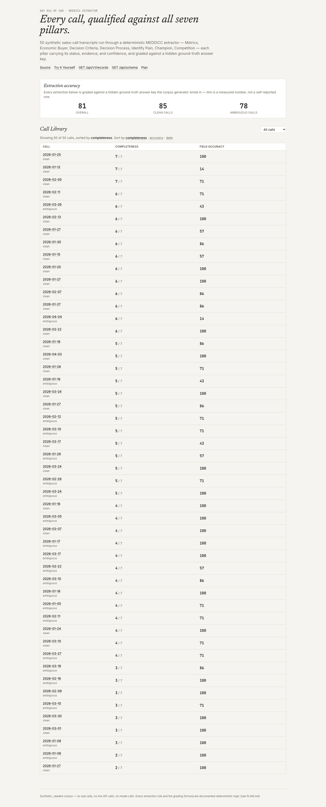

# MEDDICC Extractor

A system that extracts MEDDICC-style qualification signals from sales-call
transcripts — Metrics, Economic Buyer, Decision Criteria, Decision Process,
Identify Pain, Champion, Competition — each pillar carrying its status,
evidence, and confidence, and graded against a hidden ground-truth answer
key.

[Live Demo](https://meddicc-extractor.vercel.app) ·
[Plain-English guide](docs/plain-english-guide.md) ·
[`GET /api/v1/records`](https://meddicc-extractor.vercel.app/api/v1/records) ·
[Plan](./PLAN.md) · Day 024 of a 100-day building challenge



Opens on 50 synthetic sales-call transcripts, each already run through the
extractor and graded against its own hidden answer key. No upload, no
sign-up, no key.

> The corpus is synthetic, seeded, and committed. Each of the 7 pillars is
> drawn independently per call — found, ambiguous (two conflicting claims),
> or absent (never came up) — so calls realistically vary in which
> qualification signals actually surfaced. There are **zero model calls**
> anywhere in this repo — extraction is hand-rolled regex/keyword pattern
> matching, not an LLM, and `npm run sweep` checks nine invariants in under
> a second.

## Why I Built This

MEDDICC is the checklist B2B sales teams use to judge how real a deal
actually is. In practice it gets filled in from memory after the call,
inconsistently, and a manager reviewing the deal has no way to check the
rep's read against what was actually said. Three failures show up over and
over:

**Qualification is self-reported.** A rep marks "Economic Buyer: yes" in
the CRM. Based on what — a name mentioned once in passing, or an actual
signed-off budget authority? Nobody downstream can tell.

**Absence gets lost.** A pillar that never came up in a call is different
information from a pillar that was actively discussed and stayed unclear.
Most tracking collapses both into "not filled in."

**"It works" is asserted, never measured.** Teams adopt a qualification
tool on the strength of a demo, not a number. Nobody grades it against
calls where the correct read was already known.

This repo's subject is those three failures: a deterministic extraction
pipeline that shows the evidence and confidence behind every pillar, keeps
"found / ambiguous / absent" as three genuinely different answers, and is
graded — automatically, on every run — against a known-correct answer key.

## What It Does

**All 7 MEDDICC pillars per call, each with a status, evidence, and
confidence:**

| pillar | what it captures | confidence source |
|---|---|---|
| **Metrics** | the quantified business impact | an on-the-nose cue phrase vs. a hedged or thin one |
| **Economic Buyer** | who signs off on budget | a clear authority statement vs. a passing mention |
| **Decision Criteria** | the stated requirement | a hard-requirement phrasing vs. a vague "might matter" |
| **Decision Process** | the concrete next steps | a named process vs. a guessed-at one |
| **Identify Pain** | the business problem driving the deal | a direct statement vs. a downplayed one |
| **Champion** | the internal advocate | explicit championing language vs. a one-off mention |
| **Competition** | the named competitor, or explicit "no one else" | a direct comparison vs. a vague "might check out" |

Every pillar's status is one of three genuinely different answers — the
project's core idea:

- **Found** — exactly one clear signal. Shown with its value, evidence
  line(s), and a high/medium/low confidence read from how clean the match
  was.
- **Ambiguous** — two conflicting claims for the same pillar (two different
  numbers both called "the" savings, two different people both named as
  final approver). The honest read is "unclear," not a guess at which wins.
- **Absent** — the pillar never came up. Not the same fact as "unclear" —
  a real qualification gap, and arguably the most useful of the three to
  surface.

**Two numbers per call, deliberately kept separate:**

- **Completeness** (0–7) — how many pillars the extractor itself calls
  "found." The number a rep actually wants: how qualified does this deal
  look right now.
- **Field accuracy** (0–100%) — how often the extraction matches the
  call's own hidden ground truth. The "is this extractor any good" number,
  corpus-wide and per-call — nothing about it feeds back into completeness,
  or vice versa.

**Three screens:** the Call Library (sortable/filterable table plus a
corpus accuracy panel split by clean vs. ambiguous), a call detail page
(transcript next to the 7-pillar breakdown, every pillar showing its
evidence and grade), and **Try It Yourself** — paste any transcript and
watch the identical extractor run live in your browser, no server
round-trip.

**Zero dependency exceptions.** No NLP library, no LLM — extraction is
hand-rolled regex/keyword matching over the corpus's own transcript format.

## Demo

### A clean read vs. a genuinely mixed one


This call scores 86/100 with 3 of 7 pillars found: Economic Buyer and
Competition are clean reads at high/medium confidence; Decision Criteria,
Decision Process, and Champion are correctly flagged ambiguous (two
conflicting lines each — a genuine conflict in what was said, not a bug);
Identify Pain is found at low confidence and graded incorrect, because a
thin, hedged mention ("mildly annoying") genuinely doesn't name the same
fact as the real pain. That's the low confidence tier doing its job — it's
told upfront, not discovered by being wrong.

### Try It Yourself


Same `extractRecord` function, running client-side. No accuracy grade here
— there's no ground truth for text a visitor typed themselves, and the
page says so rather than pretending otherwise.

## How It Works

```
data/                corpus generation (transcripts + embedded ground truth, seeded RNG) + committed JSON
  ↓
lib/domain/           Call, TranscriptLine, PillarSignal, GroundTruthRecord, CallGrade — types + zod
  ↓
lib/extraction/        one generic template-matching engine + 7 pillar extractors + extractRecord
  ↓
lib/grading/            gradePillarField, gradeRecord, computeCompleteness
  ↓
lib/meddicc/            orchestration — assembles MeddiccResult, aggregates CorpusAccuracy
  ↓
app/                     three screens + /api/v1/records + /api/schema
```

1. `data/generate.ts` builds 50 synthetic calls from a fixed seed. Each of
   the 7 pillars is drawn independently per call — absent, ambiguous, or
   found at one of 3 confidence tiers — plus one per-call difficulty coin
   flip that shifts all 7 draws toward ambiguous + weak together, so a
   call's difficulty has one real, shared cause.
2. Every pillar extractor is the same generic engine
   (`lib/extraction/generic.ts`) run against a pillar-specific vocabulary
   of curated (value, sentence-template) pairs: one distinct captured value
   across the transcript is a confident read; two or more is a genuine
   conflict. Confidence comes from which tier matched — never from whether
   grading later judged it correct.
3. `lib/grading` compares the extraction to that call's ground truth
   pillar-by-pillar and produces a field accuracy score.
4. `lib/meddicc` runs every call through both and aggregates corpus
   accuracy, split by ambiguity profile.
5. The API and the Call Library read the same precomputed result; Try It
   Yourself reuses the identical `extractRecord` client-side.

## Architecture

Six downward-only dependency layers (see the diagram above). `lib/extraction/`
and `lib/grading/` are pure and deterministic — same transcript in,
byte-identical `ExtractedRecord` out, checked by sweep invariants 5 and 9.
Nothing below `app/` imports React, HTTP, or DOM APIs, so `extractRecord`
runs identically in the browser (Try It Yourself) and on the server.

## Key Decisions & Tradeoffs

- **Decision:** Extraction is deterministic regex/keyword matching, not an
  LLM call.
  **Why:** matches the zero-live-dependency convention held by prior days in
  this series, and keeps every extraction reproducible and free.
  **Tradeoff:** the extractor only generalizes to phrasing patterns it was
  built to recognize — it won't parse an arbitrary real-world transcript as
  well as an LLM would. Try It Yourself makes this limit visible rather than
  hiding it: type something outside the known patterns and watch pillars go
  unmatched instead of silently guessed.

- **Decision:** Every pillar carries a 3-way status — found / ambiguous /
  absent — instead of the simpler found/not-found other days in this series
  use.
  **Why:** for MEDDICC specifically, "never came up" and "came up but
  stayed unclear" are different facts a real qualification read needs to
  distinguish — collapsing them would throw away the project's actual
  point.
  **Tradeoff:** more states to grade correctly means more ways to be wrong;
  `gradePillarField` has 6 distinct branches instead of 2, all covered by
  unit tests.

- **Decision:** Completeness (0–7, from the extraction alone) and field
  accuracy (0–100%, extraction vs. ground truth) are computed independently
  and shown as two separate numbers.
  **Why:** conflating them would mean a *biased-but-consistent* extractor
  (one that always says "found" whether or not it's right) looks perfect
  on both metrics. Keeping them separate makes each one falsifiable on its
  own.
  **Tradeoff:** two numbers is more to explain on the page than a single
  score — the Library table and call detail header both spell out what
  each one means rather than assuming it's obvious.

- **Decision:** The corpus's first draft made the extractor a perfect
  oracle (100/100 accuracy on every call), because its regex was derived
  from the exact templates the generator wrote with.
  **Why it changed:** a perfect extractor makes confidence calibration and
  difficulty realism meaningless — there was nothing left to measure.
  Fixed by making weak-tier "found" reads genuinely imprecise (the spoken
  hedge and the canonical fact now deliberately differ) and giving each
  call a shared difficulty factor.
  **Tradeoff:** the corpus's "wrong answers" are handwritten, not emergent
  from a truly independent extractor — but the same is true of every other
  synthetic corpus in this series, and the resulting 81/85/78 split is a
  real, checked number, not a chosen one.

## Getting Started

### Prerequisites

Node.js 20+, npm.

### Installation

```bash
git clone https://github.com/akshatiwarix/meddicc-extractor.git
cd meddicc-extractor
npm install
```

### Configuration

None. No environment variables, no API keys — the corpus is committed and
every computation is local.

### Run Locally

```bash
npm run dev
```

Open `http://localhost:3000`.

## Usage

```bash
curl https://meddicc-extractor.vercel.app/api/v1/records | jq '.calls[0] | {id: .call.id, completeness: .completeness, accuracy: .grade.fieldAccuracy}'
```

```bash
curl https://meddicc-extractor.vercel.app/api/schema | jq
```

## Validation / Testing

```bash
npm test          # vitest — 76 tests: domain schemas, corpus structure, each
                   # pillar's extraction rule (found/ambiguous/absent, all 3
                   # confidence tiers), grading formulas, transcript-parser
                   # edge cases, full-pipeline determinism
npm run typecheck  # next typegen && tsc --noEmit
npm run lint       # eslint, flat config
npm run sweep      # scripts/sweep.mts — nine invariants over the committed corpus
```

`npm run sweep` output on the committed corpus:

```
  ok  1. corpus size
  ok  2. non-degenerate status mix (every pillar hits found/ambiguous/absent)
  ok  3. field bounds (status/confidence enums, completeness in [0,7], fieldAccuracy in [0,100])
  ok  4. evidence traceability
  ok  5. grading reproducibility (recompute matches precomputed)
  ok  6. confidence calibration (high-confidence correctness >= low-confidence)
  ok  7. difficulty realism (ambiguous-profile calls score lower than clean)
  ok  8. competence floor (overall field accuracy >= 75)
  ok  9. determinism (corpus generation + full pipeline, byte-identical across two runs)

Headline: overall field accuracy: 81  (clean: 85, ambiguous: 78)
```

Manually verified in-browser on the live deployment: the ambiguity filter
narrows the table's row count, all three sort columns (completeness,
accuracy, date) reorder rows correctly, a clean call and an ambiguous call
both render status/confidence/grade badges correctly (including a genuine
low-confidence miss), an unknown call id renders a proper 404, and Try It
Yourself re-extracts live on every edit with no console errors.

## Limitations

- Synthetic corpus — no real calls, no live API calls, no model calls.
- Extraction only recognizes the phrasing patterns it was built for; it is
  not a general-purpose NLU system.
- No CRM write-back — this repo produces a structured qualification read,
  it doesn't save it anywhere.
- Try It Yourself has no accuracy grade — there's no ground truth for
  arbitrary pasted text.
- 7-pillar MEDDICC only — no MEDDPICC (Paper Process) extension.

## What I'd Build Next

- MEDDPICC extension (add Paper Process as an 8th pillar).
- Editable extraction — correct a pillar and see completeness update in
  place.
- A confusion-matrix-style breakdown of grading results across the corpus,
  per pillar.
- Multi-call account rollup — MEDDICC trending across a deal's full call
  history, not just one call at a time.
- Swap the synthetic corpus for a real, anonymized, consented transcript
  export.

## License

MIT — see [LICENSE](./LICENSE).
